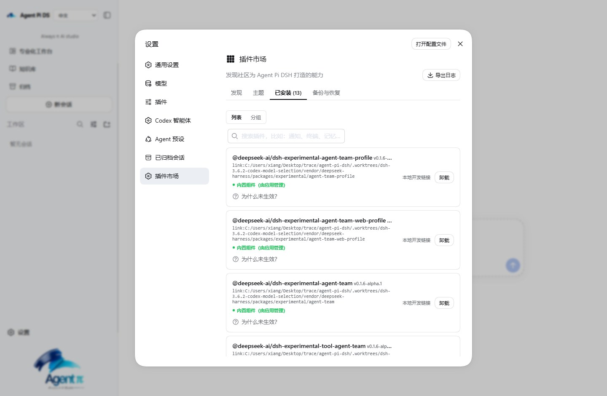
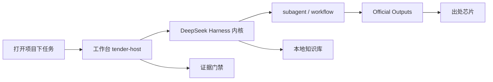
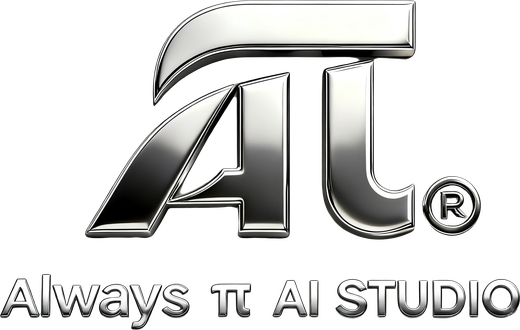

  

  

<h1 align="center">Agent Pi DSH</h1>

  工程企业的垂直智能体 
  <strong>长程任务，一次跑完</strong>

  The vertical agent for engineering enterprises. 
  Tender · delivery · investment — long-horizon jobs, finished in one run.

  
  
  

  <a href="https://github.com/xiangxin2021cn/agent-pi-dsh/releases/download/v3.6.0/Agent-Pi-DSH-3.6.0-x64.exe"><b>Windows x64</b></a>
  ·
  <a href="https://github.com/xiangxin2021cn/agent-pi-dsh/releases/download/v3.6.0/Agent-Pi-DSH-3.6.0-mac-arm64.dmg"><b>macOS arm64</b></a>
  ·
  <a href="https://github.com/xiangxin2021cn/agent-pi-dsh/releases/download/v3.6.0/Agent-Pi-DSH-3.6.0-linux-x86_64.AppImage"><b>Linux AppImage</b></a>
  ·
  <a href="https://www.agent-pi.app">官网</a>
  ·
  <a href="https://www.agent-pi.app/docs.html">文档</a>

通用办公助手陪你聊天，**Agent Pi DSH 替你干活**：吃透投标、实施、投资的垂直作业系统。长程任务不断档、目标不偏离、证据可追溯——数十份标书文件一次搞定，数千条 BOQ 逐项推导，成果直接落盘为正式文档。

> [!NOTE]
> **3.6.1 正在开发与验收，尚未发布**：开发分支已升级到官方 `dsh-v0.1.3-alpha.1`（`d347e70390`），并继续完善 Office 与 DWG 本地工程文件工作台。下方下载地址仍指向已发布的 3.6.0，不会在 3.6.1 资产通过不可变发布闸门前提前切换。

> [!IMPORTANT]
> **3.6.0 正式版**：投标流程保持“DSH 唯一执行、工作台轻量控制、一次点击一次派发”；核心依赖升级到 **`dsh-v0.1.2-rc.1`**（`a66e470204`）。Agent Pi 适配继续位于产品层启动迁移、profile overlay 和 bundle，DSH 官方源码保持干净。DWG 预览由固定源码与工具链重建，并随 Release 提供对应源码归档。
>
> 本仓库是 **3.x DSH 版源码**，与 [2.6.5 经典版（Craft Agents OSS）](https://github.com/xiangxin2021cn/agent-pi) 分库维护。3.6.0 安装包见 [DSH Releases](https://github.com/xiangxin2021cn/agent-pi-dsh/releases/tag/v3.6.0)。完整产品页：[www.agent-pi.app](https://www.agent-pi.app)

  

---

## 不是又一个聊天助手

豆包、通义办公、WorkBuddy 面向所有人的日常事务。Agent Pi DSH 只为工程企业的重活而生。

| 维度 | 通用办公助手 | Agent Pi DSH |
| --- | --- | --- |
| 任务尺度 | 几十轮对话就断片、跑题 | 小时级长程任务一次跑完；崩溃只救未完工的部分 |
| 目标控制 | 聊到哪算哪 | 阶段门禁 + 成果树锁定目标 |
| 事实可靠性 | 凭模型记忆编 | 证据门禁：查不到出处就不放行 |
| 专业深度 | 通用模板 | 投标 / 实施 / 投资垂直技能；规范、FIDIC 进知识库 |
| 数据处理 | 长文档读不动，大表格丢行 | 数千条 BOQ 逐项处理，每条带规范出处 |
| 成果形态 | 一段聊天记录 | 落盘的正式成果：版式、带公式报表、出处芯片 |

---

## 投标全流程

一次长程任务，从标书到标稿。中间材料全程不丢，每一步都可核对出处。

1. **标书全量解析，规范入库存起来** — 规范、FIDIC 与特别条款修订逐条对照
2. **数千条 BOQ，逐项界定工作范围** — 不靠印象，每条都有出处芯片
3. **五步推导，算出每一条单价** — 企业数据 + 工法工效 + 实地资源价格
4. **资源汇总与成本推定** — 带公式的组价测算表可以直接改
5. **按项目特征做施工推演** — 可执行的施工策划稿，不是套话
6. **照你的模板编制正式投标文档** — 复刻版式与深度，项目事实永远来自本项目

中标之后，投标阶段的详尽基础资料直接服务实施——成本策划有据可依。

---

## 核心能力

| | |
| --- | --- |
| **内核原生并行工人** | 工具、子任务、会话、权限由 DeepSeek Harness 直接跑，不隔一层自研调度器 |
| **Codex 子智能体** | 设置页用 ChatGPT 登录，无需 API Key；DSH 主智能体按需调用 `subagent_codex` |
| **证据门禁** | 项目特征缺口不能用模型记忆填：找到出处，或由你尽调后授权放行 |
| **Official Outputs** | 统一成果树与阶段总报告写回 `Agent Pi Outputs`；已落盘的成果重启后不再重做 |
| **出处芯片** | 只显示源文件、页或行、题目；证据正文不贴进正式稿 |
| **本地知识库** | 两条入库路、按文档章节切条款、MinerU 转可读表、用户模板、`.apkb` 传递包 |
| **崩溃只救没递交的工人** | 已完工任务不重读、不重派；只找回还没递交成果的工人 |
| **企业级插件** | 技能、工具、工作台页、验收门禁都可以加；Univer Office 0.2.13 已适配新服务路径，含 Pro 运行时的预装仍仅用于明确授权的许可构建 |

---

## 三个业务域，一套工作台

| 01 / TENDER | 02 / DELIVERY | 03 / INVESTMENT |
| --- | --- | --- |
| **投标** | **实施交付** | **投资研究** |
| 招标解析 · 项目边界 | 合同范围 · 计划进度 | 任务筛选 · 市场承购 |
| BOQ 五步组价 · 量价核对 | 成本商务 · 现金流 | 技术尽调 · 法务 ESG |
| 评审策略 · 正式写作 | 资源采购 · 风险变更 | 财务估值 |
| 递交文件与递交前审计 | 报告审计 · 工期计划器 | 交易决策 |

---

## 架构

发动机是 **DeepSeek Harness**，工作台是 **Agent Pi**。从 3.0 起，循环交给内核；投标 / 实施 / 投资、证据门禁、正式成果仍是本产品的工作台。

| 层 | 做什么 |
| --- | --- |
| 对话、模型、权限、技能目录 | dsh Web |
| 投标 / 实施 / 投资工作台 | 对话页页签 + 建项目 |
| 阶段准备、证据门禁、成果树 | 工作台插件 |
| 并行拆活 | 内核原生 `subagent` / `workflow` |
| 桌面壳 | Electron 43.4.1 |

---

## 下载与安装

| 平台 | 文件 |
| --- | --- |
| Windows x64 | [Agent-Pi-DSH-3.6.0-x64.exe](https://github.com/xiangxin2021cn/agent-pi-dsh/releases/download/v3.6.0/Agent-Pi-DSH-3.6.0-x64.exe) |
| macOS Apple Silicon | [Agent-Pi-DSH-3.6.0-mac-arm64.dmg](https://github.com/xiangxin2021cn/agent-pi-dsh/releases/download/v3.6.0/Agent-Pi-DSH-3.6.0-mac-arm64.dmg) · [zip](https://github.com/xiangxin2021cn/agent-pi-dsh/releases/download/v3.6.0/Agent-Pi-DSH-3.6.0-mac-arm64.zip) |
| Linux x64 | [AppImage](https://github.com/xiangxin2021cn/agent-pi-dsh/releases/download/v3.6.0/Agent-Pi-DSH-3.6.0-linux-x86_64.AppImage) · [deb](https://github.com/xiangxin2021cn/agent-pi-dsh/releases/download/v3.6.0/Agent-Pi-DSH-3.6.0-linux-amd64.deb) |
| 2.6.5 经典版 | [可与 3.x 并存](https://github.com/xiangxin2021cn/agent-pi/releases/tag/v2.6.5) |

国内镜像（Windows）：[gh-proxy.com](https://gh-proxy.com/https://github.com/xiangxin2021cn/agent-pi-dsh/releases/download/v3.6.0/Agent-Pi-DSH-3.6.0-x64.exe) · [ghfast.top](https://ghfast.top/https://github.com/xiangxin2021cn/agent-pi-dsh/releases/download/v3.6.0/Agent-Pi-DSH-3.6.0-x64.exe)

Windows 安装包的正式 SHA256 以同一 Release 中的 `.sha256` 资产为准；发布脚本会在上线前重新计算并核对本地文件与 GitHub 资产。

1. 下载对应平台安装包
2. 未签名：SmartScreen / Gatekeeper 选「仍要运行」
3. 打开 **Agent Pi DSH**，选择项目工作区
4. 配置 DeepSeek；看图请用带图片输入的视觉模型
5. 可选：设置 → Codex 智能体 → 使用 ChatGPT 登录；登录后 DSH 可按需委派 Codex
5. 回形针上传资料后直接下任务

覆盖安装前请**完全退出**（不要只关到托盘）。工作目录和 `Agent Pi Outputs` 接着用。会话不从 2.x 迁移。

---

## 版本沿革

| 版本 | 一句话 |
| --- | --- |
| [3.6.1（开发中）](./release/notes-3.6.1.md) | DSH 0.1.3-alpha.1；Office 0.2.13 新服务路径；DWG 完整本地预览与取景、性能收敛 |
| [3.6.0](./release/notes-3.6.0.md) | DSH rc.1；DWG 只读预览；固定工具链重建与对应源码发布 |
| [3.5.2](./release/notes-3.5.2.md) | DSH alpha.3 正式升级；长会话与图片投递适配；内核升级必须提升应用版本 |
| [3.5.1](./release/notes-3.5.1.md) | 一次点击一次派发；停止重复扫描；BOQ 与最终冻结门禁修复 |
| [3.5.0](./release/notes-3.5.0.md) | 阶段记忆与 handoff；精准失效；重启/压缩后从磁盘基线恢复 |
| [3.4.2](./release/notes-3.4.2.md) | PageIndex 长文档影子导航；类型化知识面路由；不可变证据包；五域覆盖账本 |
| [3.4.1](./release/notes-3.4.1.md) | DSH alpha.1 兼容；投标七阶段收敛；右侧文件栏与 Agent 模式恢复 |
| [3.3.6](./release/notes-3.3.6.md) | Codex 主对话指派；每会话事务控制；容量匹配与自动压缩；安装后可选启动 |
| [3.3.5](./release/notes-3.3.5.md) | 投标执行链收紧；BOQ 全量覆盖；ChatGPT/Codex 登录；父会话自动接续 |
| [3.3.4](./release/notes-3.3.4.md) | 解析必须抽出实际 BOQ；企业工效优先；预览改价全局重算 |
| [3.3.3](./release/notes-3.3.3.md) | 南非道路投标五份深度分析稿；右侧多格式预览；Univer 软件内编辑 |
| [3.3.2](./release/notes-3.3.2.md) | 知识库完善：独立入口、知识包、用户模板、子目录、`.apkb`、MinerU 转表；内核 `0.1.1-rc.2` |
| [3.3.0](./release/notes-3.3.0.md) | 内核 rc.8；知识库本页解析，列表与上传齐名 |
| [3.2.3](./release/notes-3.2.3.md) | 对话框文件夹只给路径；右键恢复注入对话 |
| [3.2.2](./release/notes-3.2.2.md) | 卸掉 J-Space 出厂技能；不再劫持 DSH 循环 |
| [3.2.1](./release/notes-3.2.1.md) | web_fetch、AnySearch；市场放行写对 pnpm 包名 |
| [3.2.0](./release/notes-3.2.0.md) | 内核 `0.1.0-rc.7`；崩溃只救未递交工人；引用变出处芯片 |
| [3.1.0](./release/notes-3.1.0.md) | 蒸馏模块、知识库、成果树、质检 |
| [3.0.0](./release/notes-3.0.0.md) | 发动机换成 DeepSeek Harness |
| [2.6.5](https://github.com/xiangxin2021cn/agent-pi/releases/tag/v2.6.5) | 经典版（Craft Agents OSS / Goal Loop），可并存 |

---

## 两个仓库 / Two repositories

- **DSH 3.x（当前）**：<https://github.com/xiangxin2021cn/agent-pi-dsh>
- **Craft Agents OSS 2.x（经典版）**：<https://github.com/xiangxin2021cn/agent-pi>

两个版本内核、源码和更新通道均分开；2.6.5 只代表经典版，不代表本仓库版本。

## 许可 / License

Agent Pi DSH 自 3.6.0 起的项目代码和发行物按 [GNU GPL v3](./LICENSE)（`GPL-3.0-only`）发布，以满足随 DWG 预览功能分发的 LibreDWG 组件要求。第三方组件仍保留各自原始许可证与版权声明，详见 [THIRD_PARTY_NOTICES.md](./THIRD_PARTY_NOTICES.md)。正式 Release 同时提供 CAD 对应源码归档及 SHA256；仅有安装包而缺少该源码资产时，发布门禁会拒绝上线。

## 开发 / Develop

当前开发分支钉住 [DeepSeek Harness](https://github.com/deepseek-ai/deepseek-harness) 的 `dsh-v0.1.3-alpha.1`（`d347e70390`），具体提交见 [DSH_PIN](./DSH_PIN)。所有兼容能力均通过 Agent Pi 产品层启动迁移、preset overlay 和 bundle 适配实现；发布门禁要求官方 DSH 子模块保持字节干净。最初迁移记录见 [3.4.0 内核迁移计划](./docs/superpowers/plans/2026-08-29-dsh-0.1.2-alpha.1-migration.md)，后续能力记录见 [3.4.2 WorkSurface 实施记录](./docs/superpowers/specs/2026-08-30-pageindex-worksurface-3.4.2-implementation.md) 和 [3.5.0 阶段记忆实施规格](./docs/superpowers/specs/2026-08-30-stage-memory-3.5.0-implementation.md)。

---

  

  <a href="https://www.agent-pi.app"><b>www.agent-pi.app</b></a>
  · Always π AI Studio
  · development kernel: dsh-v0.1.3-alpha.1

