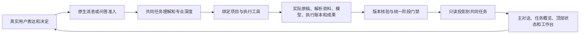

# 3.7.9 专业平台联动修复与验证

验证日期：2026-10-04。所有修复归属 3.7.9，沿用既有开发工作树及官方 DSH 内核。此次范围为专业深度、主对话、本次任务、专业化工作台及本地 Windows 安装包；中国投标路线继续暂缓。

## 已核实的原因与修复

| 断点 | 原因 | 修复后的行为 |
| --- | --- | --- |
| 本次任务空白 | 历史计划缺少 gaps/supplements，历史成果及标准字段也不齐；渲染异常进入原生错误边界 | 兼容读取缺少的展示字段，各页签安全渲染；不补造验收、签署或完成状态 |
| 切换页面后反馈落后 | 摘要订阅退出、任务缓存未共享，刷新竞争会丢弃变化，导航清理影响其他仍挂载的视图 | 保留后台订阅及所属会话，共享任务缓存，刷新排队；从当前视图进入任务或阶段仍定位正确项目 |
| 创建项目后工具不可见 | 业务绑定未在当前轮触发工具能力更新 | 使用实际原生 agent 立即同步业务能力，主会话当前轮即可继续阶段操作 |
| 执行记录无法更新 | 原生 Session.id 是 getter，展开复制对象会丢失身份 | 主会话保留实际 Session；跨目录子任务显式保留身份及上下文 |
| 资料与进度口径不一致 | 旧记录只覆盖部分文件；解析稿与原稿混用；存在源文件就被当作已解析 | 从登记的原始文件建立覆盖，核对当前源版本和真实解析资料；抽取、复核、执行登记、阶段通过分别展示 |
| 用户已决定仍卡在审批 | 真实用户决策被模型重记为新要求；阶段按钮、模型工具和主对话走不同路径 | 主对话及原生问答的明确决策走同一实际审批检查，记录真实消息编号与依据版本；一般授权不代替业务决定 |
| 用户意图被系统启动消息覆盖 | 系统阶段提示以 user 来源进入原生会话 | 只识别宿主事先登记且完全匹配的控制消息，保留最新实际用户要求 |
| 成果始终不能交付检查 | 整行保护工作台成果，也阻止主执行者添加专业检查和要求关联 | 放行主执行者的专业注释，保护文件身份、文件检查和用户权限；刷新后保留当前版本的复核 |
| 成果改动后阶段仍完成 | 成果字节失效已检测，阶段投影仍采用原盘面 done | 复用宿主同一版本失效依据，阶段显示待复核及实际原因；重新检查和批准后才恢复完成 |

## 状态与交互链路



宿主项目账本继续维护阶段及批准，共同任务保存目标、专业检查及关联。子任务贡献证据、覆盖和发现，并继承主会话绑定；不能改绑项目、修改共同目标或批准阶段。执行者登记的 completed 不等于真实阶段通过，也不等于客户验收。

## 验证结果

- 产品 Node 回归：658/658，通过；包含插件、宿主、前端、任务核心及桌面测试。
- 业务核心采用原有 Bun 测试运行器：125/125，通过。
- 当前 3.7.9 版本与安装器相关回归：80/80，通过；内核版本策略与 clean-kernel guard 通过。
- 前端专项：225/225，通过，客户端构建通过。该计数已包含在产品回归中，不能重复相加。
- 原始问题的真实项目只读核验：107 份登记原稿对应 107 个活动文件覆盖项，106 份有对应解析资料，1 份缺口仍显示；旧完成记录未被补成新的批准。重复投影幂等，未修改实际项目。
- 交付复现：真实文件检查后，主执行者可登记专业复核和要求覆盖，刷新保留；文件字节变化使成果与冻结阶段待复核，重新实际审批可恢复。伪造文件身份、文件证明、用户验收、签署及子任务覆盖均被拒绝。
- 桌面验证采用隔离临时用户目录、实际 Cordis 工具及原生 inbox；不调用付费模型。执行中切换六个任务页签、读取历史缺字段数据、四处执行重点与实时发现一致、轮询不改变批准指纹、390×844 布局及刷新恢复均有断言。

桌面复现命令：

```powershell
$env:AGENT_PI_WORKBENCH_E2E_MS='240000'
node scripts/smoke-desktop-task-guide.mjs
```

Browser plugin 未在本会话提供，使用仓库已有 Playwright/Electron。日志和截图放在隔离验证目录，失败会保留错误与截图；当前用户正在运行的程序未被重启，实际项目、账户及会话未被修改。

## 安装包验证范围

按现有 scripts/pack-win.ps1 完整重建，不复用旧 runtime 或 unpacked。构建要求准确的本地 v3.7.9 标签及干净源码，生成安装器 SHA256 与 Windows build receipt，并校验官方 DSH 构建回执、完整 Univer Office、CAD 清洁构建输入及依赖闭包。新包是否完成以 release/Agent-Pi-DSH-3.7.9-x64.exe.build.json 与实际校验结果为准。

历史发布版本的测试有固定旧版本及旧内核断言，未为了适配当前版本修改。长程自主模型任务、真实账户中的原生 Codex 自主回合及真实项目的专业结论质量尚不属于本次确定性验证；此次证明的是状态、权限、实际文件检查和交互传递链路。
