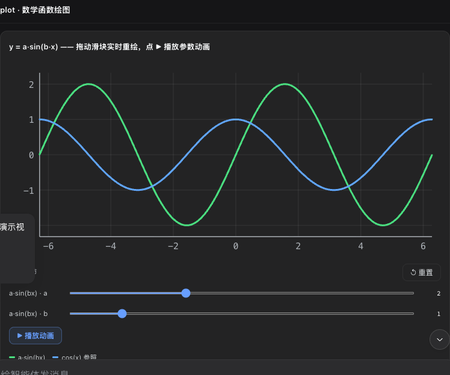

# 🎨 dsh-genui

<div align="center">

[English](./README.md) · **简体中文**

</div>

> 让模型的回答长出界面——文字还在，可交互的 UI 已经能用。
>
> 🔌 生态：仓库已挂 `#dsh` · `#dsh-plugin` topic，欢迎 @dsh-plugin 收录。

模型不再只回你文字。装上它，你问"这个月订单怎么样"，它一边分析一边在回答里渲染出一张**能点的数据面板**：看趋势、拖滑块、按刷新，模型会真的响应你。

<div align="center">

https://github.com/user-attachments/assets/f5db33ec-7471-4d4a-a85b-79c9962ab4ef

</div>

<p align="center">
  
  <br><em>实际效果：模型输出的一块可交互监控面板（点「刷新」它会重新生成数据）</em>
</p>

> 播放器没出来可 [下载 mp4](./assets/demo.mp4)；四幕演示脚本见 [demo-prompts.md](./demo-prompts.md)。

---

## ⚠️ 先看这里：双通道渲染（任何 dsh 版本都能用）

本插件自带**两套渲染通道**，启动时自动选择，不依赖特定宿主版本：

- **Registry 通道**：宿主提供 `fence-registry` 扩展点（新版 dsh 构建）时，围栏经宿主流式渲染管线注册，行为与宿主无缝；
- **DOM 通道**：宿主没有该扩展点（包括原版 DSH 与旧版构建）时，插件观察会话 DOM 自行挂载渲染树。自 0.7.2 起**支持流式渲染**：模型写到哪渲染到哪，首个完成的组件立即出现，不用等整段回复写完。自 0.8.3 起围栏发现**多表面兼容**：同时匹配标准 `md-code-block` 表面、部分宿主构建使用的 deepsuite 风格 `.code-block` / `.code-block-small` 表面，并以「label+`<pre>`」结构兜底——任何 banner 标注 `dsh-ui` 且含 `<pre>` 正文的元素都能被识别。即使你的 dsh 构建用了别的类名，围栏照常渲染（控制台会有一条一次性提示说明宿主 DOM 发生漂移）。

无论走哪条通道，组件、交互、面板、持久化行为完全一致。

---

## ✨ 装之前 vs 装之后

| 普通回答 | 装了 dsh-genui |
|---|---|
| "本月收入 ¥128,430，环比 +12.4%，建议关注转化率。" | 一行分析 + 旁边直接渲染：收入/订单/转化率三张统计卡、趋势图、进度条 |
| 想再看别的？再打一段字问一遍 | 面板上就有「刷新」「切换视图」按钮，点一下，模型更新数据 |

## 🚀 快速开始

前置条件，缺一不可：

1. **dsh 已安装**（开源版任意构建均可——插件启动时自动选择渲染通道，见上文「双通道渲染」）
2. **`pnpm` 在 PATH 上**：`dsh plugin` 命令依赖它。没有就 `corepack enable`（或 `npm i -g pnpm`），然后**新开一个终端**，确认 `pnpm -v` 有输出

安装（一行命令，自动带上全部依赖）：

```sh
# GitHub 公开仓库安装（无需 npm 账号）
dsh plugin --profile web add git+https://github.com/omdsh-dev/dsh-genui.git
```

> ⚠️ **别用 `link:` 装一个刚 clone 的目录**——`link:` 不会安装插件的依赖（mermaid / three / react），装完渲染器会挂。请用上面的 git URL 方式；只有本地开发迭代才用 link:（见下文）。

重启 dsh web + 硬刷新，新会话里说"用 dsh-ui 画个统计看板"验证。

### 一键脚本（推荐）

clone 后直接跑，脚本会检查上述前置、执行安装、并提示重启：

```sh
git clone https://github.com/omdsh-dev/dsh-genui.git
cd dsh-genui
./scripts/install.sh
```

### 开发者迭代（link 模式）

```sh
cd dsh-genui
pnpm install
dsh plugin --profile web add link:$PWD
```

## 🧩 它能做什么

- **回答即界面**：组件嵌在回答里，边生成边出现，不用等整段写完
- **30+ 组件**：卡片、表格、图表、表单、标签页、折叠面板、文件树、时间线、diff……
- **函数图**：`plot` 画曲线，参数滑块拖动实时重绘，支持自动动画

<p align="center">
  
</p>

- **测验**：`quiz` 点选判题 + 解析 + 重试；带 `action` 时答案同时回传模型（判题仍本地即时）
- **本地判卷（交卷）**：多道选择题 = 每题的 `radio` 加 `group` + `answer`（正确答案）+ `explanation`（解析），再加一个 `submit` 交卷按钮——用户全部选完点一次，**分数、每题对错、解析当场在 UI 里出现，零模型往返**；题目随即锁定，「重新作答」本地重置（可选 `resetAction` 通知模型）。题目没带答案时才退回聚合 action（`fields` 收集所有带 `id` 的输入）
- **状态持久化**：答案、交卷锁定、输入值按「会话 + 内容指纹」自动保存——刷新页面/重开会话原样恢复，重渲染相同内容保留用户状态，新内容自动从头开始；上限 200 块 LRU 淘汰
- **表单语义**：`input` 回车 / `textarea` Ctrl+Enter 即时提交（`submit:true`），不用等失焦；带 `id` 的字段值进 submit 的 `fields` 收集
- **秘密禁令**：GenUI 不得索取密码、API Key、访问令牌、恢复码或其他秘密；密码输入即使出现也保持打码、不持久化、不进表单收集
- **本地优先原则**：UI 自己能完成的状态变化（判卷、判题、重置、展开、选中）一律本地即时完成；action 只用于必须模型参与的事（生成新内容、执行工具、下一步建议）
- **诚实交互**：交互组件必须带 `action`；不带 `action` 的按钮渲染为禁用态（消灭"看着能点、点了没反应"的假按钮）；带 `action` 的按钮点击后立即显示「已触发」本地反馈（只证明本地事件已触发，不代表模型已收到）
- **事件循环**：按钮/开关/输入/下拉/复选/单选/文本域/测验带 `action`，点击/失焦回传模型，模型更新界面；同名 action 300ms 尾沿防抖，连点合并为一次（最后一次的值生效）
- **工具通道**：`render_ui` 工具把同一份 spec 渲染成工具行卡片（交付物型 UI 走工具、回答型 UI 走围栏）
- **会话面板**：composer 上方常驻 dock，`render_ui` / `panel: true` 围栏原地更新同一块界面；`/panel` 命令客户端直开（`/panel <指令>` 转模型定制、`/panel clear` 清空）；顶边框可拖拽调高；`append: true` 增量合并——同名标签页追加内容、新标签页新增；整面板默认最多 200 节点 / 200 条追加，达到上限后模型应发送 `replace` 重建
- **自愈与上限**：每个围栏过规格守卫——坏节点静默丢弃、数值钳位、字符串截断，整树 ≤200 节点 / 8 层嵌套，病态 spec 不会拖垮界面
- **图错误自愈**：mermaid 渲染失败自动修复重试（剥反引号、引号化中文/空格标签、去 `<br/>`），仍失败才降级源码；错误图永不直接上屏
- **可访问性**：tabs/折叠/开关/进度条带完整 ARIA 与键盘导航（方向键切页、Home/End 跳转）
- **零打扰**：不装插件时围栏只是代码块，不报错、不污染会话

组件 JSON 语法见 [SKILL.md](./SKILL.md)（也可复制到 `~/.dsh/skills/genui/` 增强模型使用）。

## 📄 示例

模型输出这段围栏（写给浏览器看的，你不用读懂）：

```dsh-ui
{"title":"订单概览","items":[
  {"type":"stat","label":"总收入","value":"¥128,430","delta":"+12.4%"},
  {"type":"stat","label":"订单数","value":"1,024","delta":"-3.1%"}
]}
```

你看到的是两张统计卡片。

## 🔧 原理

模型把界面描述写成 JSON 放进 `dsh-ui` 围栏，浏览器端渲染器（`src/client`）通过主仓 `fence-registry` 接口认领这门语言并渲染。组件是白名单的，模型塞不进 HTML/脚本；函数表达式走独立解析器，不用 eval。

主渲染包保持轻量（≈110 KB min / 28 KB gzip），mermaid 与 three.js 引擎单独打包为按需资产（首次用到时经插件自注册的 HTTP 路由加载），启动时只下载渲染核心。

## ❓ 常见问题

- **显示成代码块？** 查三处：dsh 版本带 fence-registry（见顶部「双通道渲染」，无扩展点的构建走 DOM 通道兜底）、`dsh plugin --profile web list` 里有本插件、重启 + 硬刷新。
- **渲染 dsh-ui fence 时聊天界面白屏？** dsh 版本太旧——先更新 dsh 再重装插件。
- **`dsh: pnpm not found on PATH`？** 装 pnpm 后**新开终端**再试（`corepack enable` 或 `npm i -g pnpm`）。
- **安装时卡在 git 凭据/404？** 仓库是公开的（`omdsh-dev/dsh-genui`），上面的 git URL 无需登录；`@omdsh-dev/dsh-genui` 返回 404，表示 npm 包尚未发布。
- **装了但 scene3d/mermaid 不渲染？** 引擎（mermaid / three）不再内联进 client.js——它们在首次用到时按需加载（`/plugins/@omdsh-dev/dsh-genui/assets/*.js`，插件自带 HTTP 路由托管）。先重启 dsh web + 硬刷新（Cmd+Shift+R）；仍不渲染就卸掉重装（`dsh plugin --profile web remove @omdsh-dev/dsh-genui` 后再 add）。旧版宿主缺少资产路由时会降级显示源码/加载失败提示，更新 dsh 即可。
- **模型不主动输出？** 重启后新会话生效；或直接说"用 dsh-ui 输出"。
- **clone 后没有 lib/？** `pnpm install && pnpm run check` 自己构建。

## 🧑‍💻 开发

```sh
pnpm install
pnpm run check   # 类型检查 + 全量测试 + 构建
```

### 真机 e2e

真实链路验证：起一个临时 dsh web → 装上插件 → 浏览器里发消息让模型输出 `dsh-ui` fence → 断言渲染 → 点击 action 按钮 → 断言模型响应（事件循环闭环）：

```sh
DEEPSEEK_API_KEY=sk-... node scripts/e2e.mjs          # link 安装当前工作区
DEEPSEEK_API_KEY=sk-... node scripts/e2e.mjs --install git   # 朋友路径（git URL）
```

前置：`dsh`/`pnpm` 在 PATH、`DEEPSEEK_API_KEY`、主仓 web 构建产物（playwright 从主仓解析）。PASS 时保存 `e2e-final.png` 截图。

## 🗺️ Roadmap（已评估项）

| 方向 | 结论 | 理由 |
|---|---|---|
| 增量 patch（模型只发 diff 不重发全量 spec） | 不做 | fence 一次 200–800 token，重发代价极小；patch 协议的教学成本与出错率不值得。若未来出现秒级自动刷新面板再议 |
| action 防抖/去重 | ✅ 已做（300ms 尾沿，按 action 名独立） | 连点刷屏是真实摩擦，收口点一处改动 |
| 跨会话状态持久化（回放恢复 tabs/开关） | 不做 | 回放重置是更正确的默认行为（模型已用新 fence 更新过界面）；流式期间状态天然保留 |
| MCP 适配器 / 独立画廊页 / i18n | 不做 | 无跨工具需求信号；画廊素材已被 `gallery.ts` + demo-prompts + README 截图覆盖；内置文案仅 6 处 |

测试解析 dsh 源码（`vitest.config.ts` 的 `DSH_ROOT`，默认 `~/.dsh/source/current`）。

## 🔗 友情链接

- [Linux.do](https://linux.do)

---

📄 License: MIT
