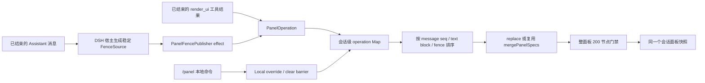

# DSH GenUI 稳定性、性能与发布加固执行计划

> 状态：可执行
> 审计基线：插件仓 `1aade42fd73c087b3f3bd7284da5c470285f0c6e`（`0.3.4`）；执行仍须重新 fetch 最新远端
> 执行者：DSH
> 计划日期：2026-08-11 至 2026-08-12
> 目标版本：`0.4.0` 候选；未获明确授权前不合并、不打标签、不发布

## 1. 结论

这不是一轮“继续加组件”，而是一轮收口。执行完成后，插件应从“功能多但边界不稳”提升到“面板顺序可靠、表单不串状态、中文输入不误提交、恶意/残缺输入不会卡住页面、安装和发布可以被重复验证”的状态。

必须按以下顺序串行推进：

1. 先在 DSH 主仓补齐围栏的稳定来源身份与真实顺序。
2. 再在插件仓重做面板发布模型，根治追加丢失、重放重复、`Infinity` 锁死和无限增长。
3. 再修表单、持久化、中文输入和密码收集边界。
4. 再处理解析器、3D 空转和指针监听性能。
5. 最后做构建、包体、安装器、E2E、CI、文档和发布事实对齐。

任何阶段都不得用随机 ID、内容哈希、时间戳、兼容层或“先忽略失败”的方式绕过根因。

## 2. 已验证基线

| 项目 | 当前事实 | 用户影响 |
|---|---|---|
| 本地测试 | 24 个测试文件、208 项测试通过 | 现有测试全绿，但没有覆盖本计划中的交叉条件 |
| 类型与构建 | TypeScript、tsdown 均能完成 | tsdown 有 3 个废弃配置警告 |
| 浏览器包 | `lib/client.js` 约 9.02 MB，gzip 约 1.72 MB | Mermaid、Three 被折入唯一浏览器包；“懒加载”不等于懒下载 |
| npm 包 | 最近一次 dry-run：114 文件、4.82 MB 压缩、25.16 MB 解包 | 带入 15.16 MB sourcemap、源码、中间 JS、map 和构建缓存 |
| 工作区 | 2026-08-12 00:14 观察到外部变化：本地 main 领先 `origin/main` 1 个生成物提交 `692a2b7`，另有未提交 `scripts/e2e.mjs` onboarding 改动 | 都不是本计划文档产生；实施必须保留现场、用独立 worktree，不得 reset、覆盖或冒充本计划改动 |
| 面板追加 | 插件把每条 Markdown 内部的局部 `key` 当成会话级来源 ID | 两条消息都在第 0 块追加时，第二条会被当成重复而丢失 |
| 面板重放 | 每个会话只记“最后一个追加来源” | A→B→A 会再次追加 A |
| 面板顺序 | 围栏默认以 `Infinity` 发布 | 一次围栏发布后，未来所有有限序号的 `render_ui` 结果都无法更新面板 |
| 面板上限 | 每条输入先修复到 200 节点，但合并后不再限总量 | 多轮 append 可无限增长并拖慢页面 |
| 表单 | tabs 创建时漏传块级答案状态 | 标签页内 grouped radio、字段收集、submit、本地判卷断链 |
| 状态 | 面板内容指纹变化但 `GenuiBlock` 不重挂载 | 旧答案、旧字段、锁定状态会写进新内容的持久化 key |
| 中文输入 | Enter/Cmd+Enter 未完整保护输入法组合态 | 中文选词的 Enter 可能被当成提交 |
| 敏感信息 | 支持 password 输入，且所有带 id 字段都明文进 localStorage | 模型生成的界面可收集并持久化密码 |
| partial 解析 | 对每个 `}` 重扫前缀并反复 `JSON.parse` | 24 KB 病态输入实测约 1.68 秒，复杂度为 O(n²) |
| 3D | 静态场景永久运行 requestAnimationFrame | 不操作时仍持续占用 GPU/电池 |
| 安装脚本 | 对不同目标的符号链接直接 `cp` | 可能覆盖链接所指向的用户文件 |
| E2E | 声明日志路径，但子进程输出被丢弃；点击后的本地文字变化可满足“响应”判断 | 失败时无日志，并可能假通过 |
| DSH 最低版本 | README 写 `47d230e`，但当前 `dsh.client` 清单至少需 `0545fdcb` | 用户按文档安装仍可能加载失败；本计划的宿主契约落地后最低版本还会再次上移 |
| 远端 CI | 最近三次运行在 runner 分配前被 GitHub Billing 拦截 | 远端没有实际执行过任何门禁，不能视为 CI 通过 |

## 3. 最终完成定义

只有同时满足以下条件，才能说这轮完成：

- 两条不同消息即使局部 fence key 都是 `0`，也会各追加一次。
- A→B→A、StrictMode、刷新、虚拟列表重挂载、乱序重放都不会重复或丢失。
- 后出现的 `render_ui` 可以覆盖更早的 panel fence；不再存在 `Infinity`。
- 合并后的整个面板始终不超过 200 个节点。
- tabs 内表单、根层表单和 accordion 内表单行为一致。
- 新内容不会继承或污染旧内容的答案、字段和锁定状态；相同内容仍可恢复自己的状态。
- 中文输入法选词不会触发 input Enter 或 textarea Cmd/Ctrl+Enter 提交。
- `password` 不再属于公开 spec，也不会被修复成普通文本框继续显示；模型提示与 Skill 明确禁止索取秘密。
- 24 KB 病态 partial 输入的 `JSON.parse` 尝试次数有确定上限，页面不再出现秒级卡顿。
- 静止 3D 场景没有永久动画帧；拖拽和滚轮时仍正常重绘。
- 安装脚本遇到不同目标或悬空符号链接时安全失败，外部哨兵文件保持不变。
- 连续构建 5 次的 `lib/client.js` SHA 完全一致。
- 发布包不含 `src/`、`.map`、`.tsbuildinfo` 或 `lib/types/**/*.js`；压缩包 <3 MB，解包 <10 MB。
- E2E 只有在“真实新助手回复/新面板结果”出现时才通过；失败日志可读且没有残留进程。
- 发布证据最终固定为一个兼容元组：`插件发布 SHA + DSH 最低宿主 SHA`；插件包、变更记录、标签、Release 和安装验证指向插件 SHA，README/兼容矩阵单独固定宿主 SHA。
- GitHub Actions 获得真实 runner 并完整跑完；`steps: []` 不算 CI。

## 4. 范围与明确不做

### 本轮包含

- DSH 主仓的围栏来源契约。
- 插件客户端的面板、表单、持久化、IME、解析器、3D 和拖拽路径。
- 插件构建、依赖、发布包、安装脚本、E2E、CI、README、Skill、系统提示和变更记录。
- 新增覆盖根因的最小回归测试与真实隔离环境验收。

### 本轮不做

- 不新增状态管理库、ID 库、解析器库、3D 控制器库或虚拟列表库。
- 不做模型 patch/diff 协议，不做新的兼容层。
- 不用 `Date.now()`、随机数、`useId()`、内容哈希代替消息身份。
- 不用 CDN 拆 Mermaid/Three，不手写另一套“轻量 3D”。
- 不改正在运行的 3080 服务，不 broad `pkill`，不占用用户当前浏览器窗口。
- 本轮默认保留 `scene3d` 产品能力，只修永久 60fps；是否删除放在独立决策门。
- 未获肠粉明确授权，不合并、不打 tag、不发布、不重启用户正在使用的 DSH 服务。

## 5. 目标数据流



核心原则：面板是“按稳定事件折叠出的结果”，不是“谁最后触发 React render 谁赢”。

## 6. 串行交付结构

| 阶段 | 仓库 | 交付物 | 依赖 | 发布阻塞 |
|---|---|---|---|---|
| 0 | 两边 | 干净基线与证据 | 无 | 是 |
| 1 | DSH 主仓 | 稳定围栏来源身份与顺序 | 0 | 是 |
| 2 | 插件仓 | 面板操作表、真实排序、总量上限 | 1 | 是 |
| 3 | 插件仓 | 表单、状态、IME、密码边界 | 2 | 是 |
| 4 | 插件仓 | partial、3D、pointer 性能 | 3 | 是 |
| 5 | 插件仓 | 确定构建、包体、依赖、安装安全 | 4 | 是 |
| 6 | 两边/CI | E2E、文档、兼容矩阵、发布候选 | 5 + Billing 恢复 | 是 |

阶段内部可以有多个原子提交，但不得跨阶段并行修改同一核心文件。

---

## 阶段 0：建立不污染用户现场的执行基线

### 0.1 使用独立 worktree

1. 在插件仓执行 `git fetch --prune origin`。
2. 记录 `origin/main` 的完整 SHA。
3. 从最新 `origin/main` 建独立 `codex/` 前缀分支和临时 worktree；先单独记录本地主工作区的 `692a2b7` 与 `scripts/e2e.mjs` WIP，不自动 cherry-pick，也不删除。
4. DSH 主仓同样从最新远端建独立 worktree。
5. 保留当前主工作区所有本地提交/WIP；禁止 `git reset --hard`、`git checkout --` 或清理这些文件。生成物提交是否吸收，等 5.1 确定构建完成后按源码与 SHA 证据判断；E2E onboarding WIP 在 6.1 合并意图，不直接覆盖。

### 0.2 记录基线

插件仓至少记录：

```sh
git status --short --branch
git rev-parse HEAD
corepack pnpm exec vitest run
corepack pnpm exec tsc -b --pretty false
corepack pnpm exec tsdown
wc -c lib/client.js
gzip -c lib/client.js | wc -c
npm pack --dry-run --json
```

DSH 主仓至少记录：

```sh
git status --short --branch
git rev-parse HEAD
corepack pnpm exec vitest run packages/client/ui-primitives packages/client/ui-conversation
corepack pnpm run typecheck
```

### 0.3 失败处理

- 基线若因现有代码失败，先记录原始错误，不把它归因于本计划。
- 依赖或网络失败要明确区分；不得通过跳过测试继续宣称完成。
- 当前远端若已变化，以实际最新 SHA 为准，并重新核对本计划引用的调用链。

---

## 阶段 1：在 DSH 主仓提供稳定的围栏来源契约

### 1.1 改动目标

当前 `FenceRenderer` 只收到 `raw + React key`。React key 只在一条 Markdown 文档内有效，不能承担会话级业务身份。

在 DSH 主仓的围栏注册模块新增：

```ts
export interface FenceSource {
  id: string
  order: readonly [messageSeq: number, textBlockIndex: number, fenceIndex: number]
}

export interface FenceRenderContext {
  /** Owning conversation route; absent outside a session-scoped chat render. */
  sessionId?: string
  source?: FenceSource
}

export type FenceRenderer = (
  raw: string,
  reactKey: Key,
  context: FenceRenderContext,
) => ReactNode
```

不用兼容旧的双参数调用；主仓和当前唯一消费者一次性切换。

### 1.2 身份规则

- session-scoped Assistant render 必须显式提供 `context.sessionId`；它只负责路由，不能继续从全局 active session 推断。
- 只在 settled 或 interrupted Assistant 已有稳定 `finalNode.seq` 时提供 `source`。
- streaming 阶段继续渲染普通 inline GenUI：`sessionId` 可用但 `source` 为空，插件不得写面板或 durable state。
- `source.id` 使用稳定结构，例如：

```ts
JSON.stringify(['assistant', finalMessageSeq, textBlockIndex, fenceIndex])
```

- `source.order` 为 `[finalMessageSeq, textBlockIndex, fenceIndex]`。
- 会话 ID 是插件面板仓库第一层键，通过 context 单独传递，不重复塞进 `source.id`。
- `fenceIndex` 必须来自 settled 文档中的稳定围栏顺序，不得使用随机数、挂载次数或时间。

### 1.3 涉及文件

DSH 主仓：

- 围栏注册接口：`packages/client/ui-primitives/src/markdown/fence-registry.ts`
- Markdown 渲染调用：`packages/client/ui-primitives/src/markdown/render.tsx`
- Markdown 组件入口：`packages/client/ui-primitives/src/markdown/MarkdownText.tsx`
- 助手块桥接：`packages/client/ui-conversation/src/client/chat/AssistantMarkdown.tsx`
- 助手节点入口：`packages/client/ui-conversation/src/client/chat/AssistantNodeView.tsx`
- 对应 ui-primitives / ui-conversation 测试。

### 1.4 实施步骤

1. `AssistantNodeView` 从 session-scoped 标准 props 读取真实 `sessionId` 并始终向下传；只在 `data.finalNode` 存在时再传稳定消息 seq。
2. `AssistantMarkdown` 继续透传真实 sessionId，并在遍历 text blocks 时加入 `textBlockIndex`。
3. `MarkdownText` 把 sessionId 与消息前缀带入 render context；无这些 props 的其他 Markdown 使用场景继续正常渲染，但没有会话路由或业务来源。
4. `renderCode` 为每个 `dsh-ui` 围栏生成 `FenceSource` 并调用三参数 renderer。
5. 更新注册接口的 JSDoc：React key 只负责 reconciliation，`source` 才负责持久业务身份。
6. 更新所有测试 renderer 和唯一插件消费者的类型。

### 1.5 必须新增的宿主测试

| 用例 | 断言 |
|---|---|
| 两条 settled 消息都只有第 0 个围栏 | 两个 `source.id` 不同 |
| 一条消息有两个 text block，各有围栏 | text block 维度不同 |
| 一个 text block 有两个围栏 | fence 维度不同，order 保持文档顺序 |
| 同一 settled 消息重复 render | ID 与 order 完全一致 |
| 两个会话交错渲染相同 seq/块/围栏位置 | source 可相同，但 context.sessionId 各自正确，发布绝不串会话 |
| streaming → settled | streaming source 为空；settled 才出现一次稳定 source |
| interrupted 消息重放 | source 稳定 |
| 普通 MarkdownText 使用场景 | 没有 source 也不崩溃、仍渲染代码块/inline UI |

### 1.6 阶段验收

```sh
corepack pnpm exec vitest run packages/client/ui-primitives packages/client/ui-conversation
corepack pnpm run typecheck
corepack pnpm run lint
```

完成后记录宿主提交完整 SHA。插件最终 README 的最低 DSH 版本必须指向“包含这个 SHA 的版本”，不能继续写 `47d230e` 或用“commit >= SHA”表达。

### 1.7 禁止方案

- 不用 `String(key)`。
- 不用 raw 内容哈希；不同消息的相同内容仍是两次独立追加。
- 不用 `useId()`、模块自增计数器、随机数或 `Date.now()`。
- 不调用 `getActiveSessionId()` 为围栏猜会话；宿主 context 缺少 sessionId 时只能降级为不持久化、不发布面板。
- 不为了保留流式面板写入而引入 generation/retry 状态机；面板只在 settled 后提交。

---

## 阶段 2：重做插件面板发布模型

### 2.1 新的会话操作模型

删除“当前 spec + `lastAppendSource` + `Infinity`”模型，改为稳定来源操作：

```ts
type PanelOrder = readonly [number, number, number]

interface PanelOperation {
  sourceId: string
  order: PanelOrder
  mode: 'replace' | 'append'
  spec: GenuiSpec
}
```

每个 session 保存：

- `Map<sourceId, PanelOperation>`：持久消息/工具操作。
- 至多一个 append overflow barrier：保留首个因节点数或操作数超限而被拒绝的完整 `PanelOperation`，供更早的乱序 replace 到达时重新做确定性折叠。
- 本地 `/panel` override：默认面板或 clear，以及它屏蔽到的最大 message seq。
- 当前折叠后的只读 snapshot。

### 2.2 围栏发布不得发生在 render 函数里

在插件围栏入口中：

1. 普通 inline spec 继续返回 UI。
2. `panel:true` 且宿主 `context.sessionId` 或 `source` 任一缺失时返回 `null`，不写仓库。
3. 两者都存在时返回一个 keyed publisher 组件，并把 context 中的真实 sessionId 作为明确 prop；不得在 effect 执行时再读取全局 active session。
4. publisher 在 `useEffect` 中向该 session 提交 `PanelOperation`，自身返回 `null`。
5. StrictMode 重复 effect 由 operation Map 的 source 去重，不得重复通知。

这样既消除 render side effect，也保证 streaming 不会先以临时身份写一次、settled 再写一次。

### 2.3 工具发布规则

`render_ui` 已结束结果使用：

```ts
sourceId = JSON.stringify(['render_ui', block.callId])
order = [block.seq, -1, 0]
mode = 'replace'
```

工具和围栏进入同一个 operation 管道；删除另一套默认排序规则。

### 2.4 折叠算法

每次首次收到新来源，执行一次事务式候选折叠：

1. 若来源早于或等于当前本地 clear/override barrier，拒绝旧重放。
2. 若 `sourceId` 已在 operation Map 或正是 overflow barrier 的 source，直接返回，不通知、不重复诊断。
3. 已存在 overflow barrier 时，排序不晚于 barrier 的新旧 append 仍可进入候选重算；更晚的 append 直接拒绝。任何 replace 都进入候选，由“最新 replace”规则判断是否有效；这样乱序到达但位于 barrier 前的 replace 也能正确重开后续 append。
4. 不先修改正式 Map；把现有 overflow operation 与新 operation 一起加入临时副本，按三段 `order` 升序排序，从最新有效 replace 开始候选折叠，更早操作直接裁掉。
5. `replace` 直接替换；`append` 复用现有纯函数 `mergePanelSpecs`。接受 append 的 spec 必须至少有一个有效节点。
6. 每次 append merge 后复用现有 `validateGenuiSpec` 的全树节点计数；候选结果超过 200 节点时，把这一条记为首个 overflow barrier，跳过它以及排序更晚的 append，保留此前合法 snapshot。不得另写第二套节点遍历，也不得把 201 节点交给 React。
7. 同一 latest replace 之后最多保留 200 条 append operation，直接复用 `GENUI_LIMITS.maxNodes` 这个 200，不新增另一项配置；第 201 条即使节点数仍未增长，也按同一 overflow barrier 规则要求下一次使用 replace。这是 operation Map 的明确内存上限。
8. 候选 snapshot、裁剪后的 Map、overflow barrier 全部计算成功后才一次性提交；任何校验异常都保持旧正式状态。snapshot 真正变化时才通知一次。
9. 更晚 replace 成功后，删除更早 operations 与旧 overflow barrier；session 销毁时清空 Map、barrier、snapshot 与订阅者。

因此每个 session 最多保留“最新 replace + 200 条 append + 1 个 overflow marker”。达到节点或操作上限后，系统提示、Skill 和诊断都要求模型发送 replace；不引入 LRU，也不按到达顺序猜测淘汰。

### 2.5 `/panel` 本地命令

删除通过 `publishPanelSpec(sessionId, null/default)` 伪装持久消息的方式，提供明确的本地接口：

- `setLocalPanel(sessionId, DEFAULT_PANEL_SPEC)`：立即显示默认面板并展开，同时记录当前最大已见 message seq 作为 barrier。
- `clearLocalPanel(sessionId)`：立即清空，同样记录当前最大已见 message seq 作为 barrier。
- 下一条更晚的真实工具/围栏操作可以越过 barrier；旧历史重放不能复活面板。
- 折叠时先把 local override 作为 base，再处理 barrier 之后的真实操作：新 replace 替换它，新 append 合入它；clear 的 base 为 `null`。

不要伪造 `Infinity`、`MAX_SAFE_INTEGER` 消息或随机 source。

### 2.6 inline 状态身份一并修正

当前 inline durable key 也使用局部 fence key，两个消息若位置和内容都相同会串状态。改为：

- streaming：`stateKey` 为 `undefined`，不写 localStorage。
- settled：使用宿主 `context.sessionId + source.id` 构建 `fenceStateKey`；不得读取全局 active session。
- 顶层 `ErrorBoundary` 的 React key 使用 `source.id ?? reactKey`；这同时修复 React “顶层数组元素缺 key”警告，并在 streaming→settled 时原子重挂载。
- 删除内部 `GenuiBlock` 上无效的重复 key。

### 2.7 面板内容状态重挂载

在面板组件中只计算一次：

```ts
const stateKey = panelStateKey(sessionId, JSON.stringify(spec))
```

把 `stateKey` 同时作为面板 `ErrorBoundary` 的 React key 和 `GenuiBlock.stateKey`。内容指纹变化时整棵交互树原子重建；不要用 `useEffect([stateKey])` 分步清空。

### 2.8 涉及文件

插件仓：

- 围栏入口：`src/client/index.tsx`
- 面板仓库：`src/client/panel-store.ts`
- 工具卡入口：`src/client/toolview.tsx`
- 本地面板命令：`src/client/panel-command.ts`
- 面板组件：`src/client/panel.tsx`
- 交互 key：`src/client/interaction-store.ts`
- 面板、append、持久化和 fence 测试。

### 2.9 必须新增/替换的测试

| 用例 | 断言 |
|---|---|
| 两条消息的局部 key 都为 0 | 两次 append 都保留 |
| 两个会话交错重放相同 source/order | 各自只更新自己的 session 面板与 durable state |
| 两条消息内容完全相同 | 仍各追加一次 |
| 同一 source 重复 3 次 | 只追加、通知一次 |
| A→B→A 到达 | A、B 各一次 |
| B 先到、A 后到 | 最终仍按 A→B 折叠 |
| replace 20 后重放 append 10 | 旧 append 不影响结果 |
| fence 20 后 tool 30 | tool 胜 |
| tool 30 后重放 fence 20 | tool 仍胜 |
| 同消息两个围栏 | 由 text/fence order 决定，不由 effect 顺序决定 |
| clear 后旧 A 重放 | 面板不复活 |
| 设置默认面板后旧 A 重放 | 只保留默认面板，旧 A 不重新合入 |
| clear 后新 C | C 正常建立面板 |
| append 后总节点将达 201 | 本次 append 被拒，DOM ≤200 |
| 同一超限 source 重放 3 次 | Map/snapshot 不变，只产生一次诊断 |
| 超限后到达更晚 append | 被 overflow barrier 幂等拒绝，不增加 Map |
| 超限后到达更晚 replace | replace 生效并清理旧 barrier，随后 append 可恢复 |
| 200 次同标签 tab 更新后第 201 次 append | 即使节点数没增长也拒绝，Map 保持固定上限 |
| StrictMode publisher | snapshot 与通知均只发生一次 |
| 相同 inline spec 位于两条消息 | 两块 durable state 相互独立 |
| 面板 A 已作答后原地换 B | B 无旧答案、字段、locked，且 A 不写进 B 的 key |
| 文本 + 两个有效围栏 | 无 React unique key 警告，两个都渲染 |

删除现有“fence = Infinity 永远胜”的测试，替换为真实顺序测试；不得保留错误预期。

### 2.10 阶段验收

```sh
corepack pnpm exec vitest run tests/genui-panel.spec.tsx tests/panel-append.spec.tsx tests/genui-v27.spec.tsx tests/genui-error-boundary.spec.tsx
corepack pnpm exec vitest run
corepack pnpm exec tsc -b --pretty false
```

真实隔离会话再验：连续两轮各输出一个 `panel:true, append:true` 围栏，且两个围栏在各自消息里都是第一个 Markdown 块；面板必须同时保留两轮内容。

### 2.11 禁止方案

- 不把 `lastAppendSource` 简单换成有限 LRU 或 Set 后继续按到达顺序 merge。
- 不用 raw hash 去重。
- 不用 `Infinity`、`MAX_SAFE_INTEGER` 或时间戳换一种方式继续“最后调用者赢”。
- 不在 renderer 纯函数里直接写外部 store。
- 不为了无限 append 引入虚拟列表；本轮直接执行整个面板 200 节点上限。

---

## 阶段 3：表单、状态、IME 与敏感信息边界

这一阶段集中修改 `GenuiBlock.tsx`，避免多条分支反复冲突。

### 3.1 tabs 透传块级答案状态

在 `renderNode` 的 tabs 分支补 `answers={answers}`。不在 `TabsNode` 里新建仓库或 Context。

测试必须包含：

- tab 内 grouped radio + input(id) + submit。
- tab 内本地判卷、锁定、重新作答。
- 切换 tab 再返回，块级答案仍在。
- payload 同时包含正确的 `answers` 和 `fields`。

### 3.2 简化答案状态

删除未被读取的 `AnswerEntry.label`：

- 内存答案改为 `Record<string, string>`。
- `setAnswer(group, choice)` 只比较字符串。
- 题目显示继续唯一读取 `QuestionMeta.label`。
- localStorage 结构本来就是字符串表，不做迁移、不加兼容层。
- submit payload 不再做 `{label, choice}` 到字符串的二次转换。
- 在 Radio 的 React key 中加入已有 `round`，删除监听 round 再 `setSelected` 的同步 effect。

验收：v2.5/v2.6/v2.7 的答题、判分、错误答案、重试、刷新恢复和 action payload 行为不变，代码净减少。

### 3.3 建立字段不变量

- `value.trim() === ''` 时从共享 `fields` 删除该 id。
- 非空时保存用户原字符串，不擅自 trim payload。
- Input/Textarea 初次挂载时，把非空 `node.value` 注册到共享 fields。
- Submit 计算 `answered`、ready 和 payload 时统一使用同一个 `filledFields`；防御性过滤空白值。
- 不把“任一字段非空即可提交”擅自改成“所有字段必填”。

测试：输入后清空重新禁用、纯空格禁用、一空一非空只发送一个、默认值初始可提交、非空值原始空格保留。

### 3.4 复用 DSH 已验证的完整 IME 保护

Input 的 Enter 和 Textarea 的 Ctrl/Cmd+Enter 都要使用 DSH 主输入框的三层判定：

1. `compositionstart` 置 composing ref。
2. `compositionend` 延迟 10ms 清 ref，覆盖 Safari closing keydown 顺序。
3. keydown 同时检查 ref、`nativeEvent.isComposing`、`nativeEvent.keyCode === 229`。

测试：

- `isComposing:true` 不提交。
- `keyCode:229` 不提交。
- compositionStart→compositionEnd→紧接 Enter 不提交。
- 延迟结束后的普通 Enter 只提交一次。
- Textarea 的 Ctrl+Enter、Cmd+Enter覆盖同样路径。

真实验收必须在隔离 DSH 页面用中文拼音完成“输入候选→Enter 选词→再次 Enter 提交”；第一次 Enter 不产生模型消息。

### 3.5 删除 password 能力

这是安全边界，不保留兼容：

- `GenuiInput.inputType` 只保留 `text | email`。
- guard 遇到已知 input 节点且 `inputType === 'password'` 时丢弃整个节点；不得静默去掉属性后渲染成可见文本框。
- validator 给出可诊断错误。
- 系统提示、`SKILL.md`、README 和示例删除 password。
- 增加明确规则：GenUI 不得索取密码、API Key、访问令牌、恢复码或其他秘密。
- 测试恶意 password spec 不产生 input DOM，也不向 localStorage 写入值。

### 3.6 诚实点击反馈

把按钮本地 chip 从“已响应”改为“已触发”或“已点击”。前者只证明本地事件被触发，不能暗示模型已收到或已经响应。

本轮不扩展整个 `GenuiActionHandler` 为 Promise；当宿主提供统一发送失败反馈通道后再做异步成功/失败状态。现有 catch 至少记录不含 action payload/秘密值的错误和 session 定位信息，不得无声吞掉。

### 3.7 阶段测试与验收

```sh
corepack pnpm exec vitest run tests/genui-v25.spec.tsx tests/genui-v26.spec.tsx tests/genui-v27.spec.tsx tests/genui-hardening.spec.tsx
corepack pnpm exec vitest run
corepack pnpm exec tsc -b --pretty false
```

完成标准：tabs、根层、accordion 三处表单语义一致；IME 不误发；空字段不算完成；password 无渲染、无持久化、无教学文案。

---

## 阶段 4：解析、3D 和指针性能

### 4.1 把 partial 解析从无界尝试改为有界线性工作

保留现有完整 JSON 快速路径，不引入解析器依赖；把当前“每遇到一个 `}` 就重新扫描前缀”改成真正的一次前向扫描。

实施：

1. 复用 `GENUI_LIMITS.maxDepth`，定义一个总修复候选/尝试上限 `MAX_PARTIAL_REPAIR_ATTEMPTS = 32`，不再增加第二套深度数字。
2. 完整 `JSON.parse` 最多一次。
3. 用一个小型纯候选收集器从左到右只读原文一次：继续正确跳过字符串/转义，维护括号栈；在有效对象闭合且栈深不超过现有 8 层限制时，直接记录 `{ end, closingSuffix }`，固定环形缓冲区只保留最长方向需要的 32 个候选。
4. balanced prefix 与 unfinished candidate 在这次扫描中合并、去重；扫描结束后从最长候选开始 `JSON.parse`。禁止在 `}` 循环里调用 `scanBrackets(text.slice(...))`，也禁止对任一 prefix 做第二次括号扫描。
5. 达到 32 次后返回 `null`，等待更多流式内容或 settled fallback。
6. 加 `ponytail:` 注释说明：单次扫描 + 32 次 parse 是当前深度 8、节点 200 下的保护上限；只有真实流式样本证明恢复率不足时才改成 tokenizing parser。
7. 不另加低于现有合法 spec 能力的随意 raw 字节上限。

测试：

- 保留全部现有 partial 前缀恢复用例。
- 构造审计中的约 24 KB、8000 个闭合对象病态输入。
- 候选收集器在测试中返回/暴露 `scannedChars` 诊断值（不从包入口导出），断言等于输入长度且候选数 ≤32；源码中 parser 只能调用该收集器一次。
- spy `JSON.parse`，断言总调用不超过 33（完整一次 + 修复 32）。
- 记录同一机器 20 次 benchmark 的 P95；目标 <50ms，但时间值只做本地证据，不作为易抖动 CI 断言。

### 4.2 先过 scene3d 删除决策门

先做产品决策，再写 3D 优化，避免重构完马上删除。

本轮默认不删。原因：它是已公开、已演示的产品能力；只有同时满足下面两项才改为删除路线：

1. 从真实会话证明发布以来 `scene3d` 使用为 0，统计必须排除 gallery/demo/test。
2. 产品明确确认删除。

若确认删除，则在独立提交中删除以下内容，并跳过 4.3 与 4.4 中所有 scene3d 专属改动：

- 3D renderer、组件分支、spec、guard、CSS、gallery、默认面板统计、系统提示、Skill、README、demo 和测试。
- `three`、`@types/three` 及锁文件。
- 不保留旧 spec 兼容层。

删除验收：`rg scene3d` 只允许历史 changelog；client.js 预计至少减少约 1.8 MB。没有证据或确认时，记录“保留”，再进入 4.3。

### 4.3 保留时把静态 3D 改为事件驱动渲染

- 删除永久 `requestAnimationFrame` 循环和 `cancelAnimationFrame`。
- 场景初始化完成后 render 一次。
- orbit 更新相机后立即 render 一次。
- pointer move（正在拖拽）与 wheel 触发 orbit/render。
- 静止时 0 个持续动画帧。
- 保留 mesh、geometry、material、renderer 的正确 dispose。

测试/验收：

- 模拟初始化后 renderer 只 render 一次。
- 静置一秒不增加 render 次数。
- 一次 drag move 和一次 wheel 各增加一次 render。
- 真实 headless Chrome 中拖拽、缩放仍有效；Performance 录制静止场景无持续 RAF。

### 4.4 使用 Pointer Capture 删除全局监听

面板拖拽复用仓库内函数图的原生模式：

- pointerdown 在 handle 上 `setPointerCapture(pointerId)`。
- move/up/cancel 都绑定 handle。
- 删除 window pointermove/pointerup 注册、注销和清理 effect。
- 保留 120–600px 夹取、折叠后的高度记忆和可访问性 separator。

仅在 4.2 选择保留 scene3d 时，把 3D canvas 的拖拽移到 canvas pointer capture，删除 scene3d 的 window pointer 监听；若选择删除，不写这段即删代码。

测试：面板拖出元素边界仍连续、pointercancel 清 active、松手后不再改变、卸载无残留；保留 3D 时对 canvas 跑同样用例。对应源码不再出现 window pointer listener。

### 4.5 阶段门禁

```sh
corepack pnpm exec vitest run tests/genui-partial.spec.tsx tests/genui-panel.spec.tsx tests/genui-v12.spec.tsx
corepack pnpm exec vitest run
corepack pnpm exec tsc -b --pretty false
```

---

## 阶段 5：确定构建、缩小安装包、加固安装器

### 5.1 先单独固定 CSS 导出顺序

在 CSS Modules 的 classMap 构造前按本地类名做固定 UTF-16 排序：

- 不用 `localeCompare`，避免系统 locale 差异。
- 不改变 hash 类名和值，只固定对象键顺序。
- 不新增测试专用生产导出。

验收：同一干净 worktree 连续构建 5 次，`shasum -a 256 lib/client.js` 完全一致；macOS 提交的产物在 Ubuntu CI 重建无 diff。

### 5.2 tsdown 直接从 src 构建，tsc 只产声明

这一组必须原子提交：

1. `tsconfig.json` 增加 `emitDeclarationOnly: true`。
2. 关闭 `declarationMap`，删除无意义 `sourceMap`。
3. 单包没有 project reference：脚本改用 `tsc -p tsconfig.json`，删除 `composite`、`incremental`，不再生成 `tsconfig.tsbuildinfo`。
4. tsdown client entry 改为 `src/client/index.tsx`。
5. Node entries 改为 `src/plugin/index.ts`、`src/plugin/invariant.ts`。
6. CSS 直接按源码 importer 解析，删除 `sourceAssetPath`、`existsSync`、`sep` 和 `lib/types` 回溯逻辑。
7. 生产浏览器包关闭 sourcemap，删除 sourceMappingURL 和 sourcemap 路径转换代码。
8. 按当前 tsdown 类型与警告，把：
   - `external` 改为 `deps.neverBundle`
   - `noExternal` 改为 `deps.alwaysBundle`
   - `inlineDynamicImports` 改为 `codeSplitting: false`
9. 删除 `lib/types` 下 20 个中间 JS、20 个 JS map、20 个 d.ts map；保留 d.ts 与顶层三个运行 JS。

预期净收益：约 -60 文件、-3827 行生成代码，0 新依赖。

验收：

```sh
corepack pnpm run check
node --check lib/client.js
node --check lib/index.js
node --check lib/invariant.js
test -z "$(find lib/types -type f \( -name '*.js' -o -name '*.map' \) -print -quit)"
```

最后一项是失败式断言；失败时再打印完整 `find` 结果帮助定位，不能因为 `find` 自身返回 0 而假绿。tsdown 运行不得再出现上述三条废弃配置警告。

### 5.3 依赖按真实运行边界归类

| 依赖 | 最终位置 | 原因 |
|---|---|---|
| `mermaid` | devDependency | 已内联进 client.js，仅构建需要 |
| `three` | devDependency | 本轮若保留 3D则已内联，仅构建需要 |
| `react` | peer + dev | 运行由 DSH 模块表提供，构建/测试本地需要 |
| `react-dom` | dev only | 源码零 import，只是测试工具需要；删除 peer |
| DSH 内部包、Cordis | peer | 运行由宿主提供 |

同时：

- 删除 EXTERNALS 中没有实际 import 的 `react-dom`、`react-dom/client`。
- 更新锁文件。
- 修正文档中“git/link 安装需要下载 Mermaid/Three/React”的过期说法。
- 验证生产 bundle 不含 `require('mermaid')`、`require('three')`、`require('react-dom')`。

这一步减少用户安装依赖，不会让 9.02 MB 浏览器包自动变小；不得虚报 bundle 收益。

### 5.4 固定工具链

在包清单增加：

```json
{
  "packageManager": "pnpm@11.7.0",
  "engines": {
    "node": "^22.19.0 || >=24.0.0",
    "pnpm": ">=11.7.0 <12"
  }
}
```

与 DSH 主仓和 CI 对齐。不要让安装脚本自动修改用户全局工具链；pnpm 不满足时给出命令并失败。

### 5.5 收紧发布包表面

- 删除 `exports['./src/*']`。
- 保留 `exports['./package.json']`；现有安装器和 DSH 客户端模块发现都要解析包清单，不能把“删除源码出口”扩大成删除包清单出口。
- `files` 删除 `src`，改成明确白名单：
  - `lib/index.js`
  - `lib/invariant.js`
  - `lib/client.js`
  - `lib/types/plugin/index.d.ts`
  - `lib/types/plugin/invariant.d.ts`
  - `lib/types/client/index.d.ts`
  - `SKILL.md`
  - `README.md`
  - `CHANGELOG.md`
  - `demo-prompts.md`
  - `cordis.patch.yml`
- `package.json` 与 `LICENSE` 由 npm 强制包含，不需要写进 `files`，但必须列入 pack 校验的允许清单。
- 不删除仓库源码，只是不发布源码逃生口。
- 当前组织代码搜索没有 `@omdsh-dev/dsh-genui/src/*` 消费者；不增加兼容导出。

新增一个小型 `scripts/verify-pack.mjs`，读取 `npm pack --dry-run --json` 并断言：

- 三个运行 exports 的 JS 与类型入口存在，`./package.json` export 仍可解析。
- 没有 `src/`、`.map`、`.tsbuildinfo`、`lib/types/**/*.js`。
- 压缩包 <3 MB，解包 <10 MB。
- 发现未知文件或超限时列出实际条目，不静默放宽阈值。

### 5.6 修复安装脚本的文件安全边界

安装器先验证 profile 参数只含允许字符，Node 解析路径使用环境变量，不把用户路径插进 `node -e` 字符串。

同步 Skill 时明确分类：

| 目标状态 | 行为 |
|---|---|
| 不存在 | 同目录临时文件 + 原子 mv 创建 |
| 普通文件 | 同目录临时文件 + 原子 mv 替换 |
| 相对/绝对 symlink，解析后与来源同一文件 | 成功跳过，不改链接 |
| symlink 指向其他文件 | 安全失败，显示目标，不跟随写入 |
| 悬空 symlink | 安全失败 |
| 目录 | 安全失败 |

其他要求：

- 不再直接 `cp "$SKILL_FILE" "$DEST"`。
- 临时文件异常退出要清理。
- 冲突和包内 Skill 缺失必须非零退出，不能谎称完整安装成功。
- pnpm 缺失时不自动执行 `corepack enable`；只给明确操作提示。

新增 `tests/install-script.spec.ts`，用临时 `DSH_HOME`、假 `dsh/pnpm/git` 和真实 shell 驱动上述七类场景。最关键用例必须证明不同目标 symlink 指向的哨兵内容字节不变。

### 5.7 阶段门禁

```sh
test "$(corepack pnpm --version)" = "11.7.0"
corepack pnpm install --frozen-lockfile
corepack pnpm run check
node scripts/verify-pack.mjs
git diff --exit-code -- lib/
test -z "$(git status --porcelain=v1 --untracked-files=all -- lib)"
```

- 后续一律继续使用 `corepack pnpm`，不得又落回 PATH 上的裸 pnpm。
- 最后一条把未跟踪生成物也纳入失败条件；若失败，打印完整 status 后停止。
- 生成真实 tarball，在临时 consumer 中用 `npm install --ignore-scripts --omit=dev --legacy-peer-deps <tarball>` 只验证文件表、四个 exports 路径和“没有 Mermaid/Three 运行依赖副本”；这一阶段不声称浏览器渲染通过。
- 普通围栏、Mermaid、保留时的 scene3d 与真实 profile 加载统一移到阶段 6，使用修好日志/防假通过后的 E2E 验证。

---

## 阶段 6：让 E2E、CI、文档和发布只报告真实状态

### 6.1 E2E 启动前预检

`scripts/e2e.mjs` 在启动任何进程前检查：

- `--install` 仅允许 `link | tarball | git`；tarball 模式必须收到实际 `.tgz` 绝对路径和预期 SHA256。
- 端口合法且空闲；未指定时用 Node 标准库申请空闲端口。
- `--dsh-root` 与 `--dsh-bin` 都是绝对路径；`realpath(--dsh-bin)` 必须位于同一个 `realpath(--dsh-root)` 下，默认不从 PATH 寻找 `dsh`。
- DSH_ROOT、精确宿主二进制、Playwright 入口、Chrome 可加载。
- 记录 `git -C "$DSH_ROOT" rev-parse HEAD`，并与调用方声明的宿主 SHA 完全一致；日志开头同时打印宿主 SHA、插件 SHA/包 SHA、Node 与 pnpm 版本，但不打印任何 Key。
- DSH checkout 含阶段 1 的 fence source 契约和 `dsh.client` 清单读取能力。
- link 模式已存在三个构建入口；tarball 模式文件与 SHA 匹配；git 模式仓库与完整 ref 可访问。
- 吸收当前 `scripts/e2e.mjs` WIP 的正确意图：新 profile 若出现“选择工作区”，用 filechooser 选择 E2E 临时工作区；随后必须等 composer 真正脱离 inert/disabled。等待超时要保存截图与日志并失败，禁止保留 `.catch(() => {})` 后继续 fill 的假容错。
- 完整模型模式要求 API Key，但绝不打印；`--smoke` 模式不要求 Key。

### 6.2 真实日志与窄清理

- dsh web 的 stdout/stderr 真正写进 `webLog`。
- 启动失败输出日志尾部。
- cleanup 放进 `finally`；不要依赖 `process.on('exit')` 的异步清理。
- 先向精确 child/process group 发正常终止，超时后才强制结束。
- 禁止 broad `pkill`；不能触碰用户现有 3080 listener。
- 失败保留或复制日志和截图到稳定 artifacts；成功才清临时目录。

### 6.3 杜绝 action 假通过

当前 `lastText()` 会被按钮本地“已响应”改变。改为使用 DSH 已有稳定 DOM 标记：

1. 点击前记录最后一个 `[data-chat-flow-kind="assistant-step"]` 的 `data-chat-flow-key`。
2. 等待当前助手完成（内部不再有 `[data-streaming]`）。
3. 点击 action。
4. 必须出现新的 assistant-step key，且新节点结束 streaming；或出现由新 operation source 驱动的面板 snapshot。
5. 仅按钮 chip 或同一 DOM 文本变化不得算响应。
6. 页面 `pageerror`、client.js 404 或新回复超时都失败。

git 安装增加 `--ref <完整 SHA>`，URL 固定到候选提交；不再测试变化中的 main 后声称候选通过。

### 6.4 两层 E2E

| 层 | 何时跑 | 不使用/使用模型额度 | 断言 |
|---|---|---|---|
| `--smoke` | 每个 PR CI | 不使用 | 精确宿主二进制、安装、profile、首页 200、client.js 200、页面无异常、插件 boot |
| 完整 E2E | 手动发布门禁 | 使用受保护 Key | 精确宿主二进制、模型 fence、UI、action 消息、真实新助手回复、面板更新 |

完整 E2E 必测三条路径，且都使用同一宿主 SHA：link 当前候选、实际 tarball + SHA256、git 固定插件 SHA。tarball 路径负责完成阶段 5 延后的普通围栏、Mermaid、保留时 scene3d 和真实 profile 加载验收。

### 6.5 修复 CI 路径与矩阵

当前 CI 克隆 DSH 到 `$HOME/.dsh/source/current`，但 tsconfig/vitest 的 `../../.dsh` 在 GitHub workspace 下解析到另一目录。统一为一个明确的 `DSH_ROOT`：

- CI 先把 `DSH_ROOT` 计算为 `$GITHUB_WORKSPACE/../../.dsh/source/current` 的规范化绝对路径，再克隆到该处；这样也与现有 TypeScript paths 一致。
- 每个矩阵把目标 DSH ref 解析成完整 SHA，checkout 后先断言 `git -C "$DSH_ROOT" rev-parse HEAD` 等于该 SHA，再在该 checkout 内执行 `corepack pnpm install --frozen-lockfile` 与 `corepack pnpm run build`。
- E2E 的 `DSH_BIN` 固定为构建出的绝对路径 `$DSH_ROOT/apps/cli/lib/bin.js`；所有 `dsh web/run/plugin` 子命令都直接 spawn 这个文件，禁止调用 PATH 上的全局 `dsh`。把真实宿主 SHA 与 DSH_BIN realpath 保存为 CI artifact。
- `vitest.config.ts` 真正读取 `process.env.DSH_ROOT`，默认才使用本机路径。
- 阶段 1 尚未合并时，插件验证必须显式指向宿主候选 worktree；不得临时改动活跃 `~/.dsh/source/current`。可在 `/private/tmp` 生成只用于该次 `tsc -p` 的扩展配置覆盖 paths，绝不提交机器绝对路径。
- 检查前用 `test -f "$DSH_ROOT/packages/client/ui-primitives/src/index.ts"` 显式预检。

账单恢复后设置两个阻塞矩阵：

| Node | DSH ref | 目的 |
|---|---|---|
| 22.19.x | 阶段 1 宿主契约的不可变 SHA/标签 | 最低支持版本 |
| 24.x | DSH 当前 main | 前向集成 |

每个矩阵运行：冻结安装、类型检查、全量测试、构建、pack 校验、lib drift 和 no-key smoke。

### 6.6 GitHub Billing 外部阻塞

最近失败运行：`31501520044`、`31427328829`、`31426561376`。三次均为 `steps: []`、`runner_id: 0`，原始原因是近期付款失败或 spending limit。

组织管理员需先：

1. 修复 GitHub Billing 或提高 Actions spending limit。
2. 重跑最新失败 run，确认获得非零 runner 且 steps 真正执行。
3. 再验证 `DSH_REPO_TOKEN` 能只读 clone 私有 DSH 仓；它不是当前账单失败原因，但此前从未实际跑到该步骤。
4. 把两个兼容矩阵设为 required checks。

Billing 未恢复时可以完成本地代码和 PR，但不得宣称发布门禁完成。

### 6.7 文档事实修正

README：

- 删除“commit >= SHA”的表达；Git SHA 没有大小顺序。
- 最终写“需要包含阶段 1 宿主提交 `<SHA>` 的 DSH 版本”。
- 可在历史说明中指出 `0545fdcb` 是本计划前当前清单契约的最低已验证点，但它不满足新 FenceSource 契约。
- 删除硬编码“135 测试”，改为“类型检查 + 全量测试 + 构建”；当次 208+ 证据放 CI/Release。
- 把“面板可无限长大”改成“整面板最多 200 节点，达到上限后应发送 replace”。
- 删除 git/link 必须下载 Mermaid/Three/React 的过期说法。
- 删除 password 教学，增加秘密信息禁令。
- 更新 E2E 命令与 smoke/固定 SHA 说明。

`CHANGELOG.md`：

```text
# Changelog

## [Unreleased]
### 新增
### 修改
### 修复
### 安全

## [0.3.4] - 2026-08-11
...
```

保留历史版本当时的数字，不伪造历史标签。阶段全部验收后再把 Unreleased 转成 `0.4.0`。

系统提示与 `SKILL.md` 必须同步：stable panel 语义、200 节点总上限、password 禁令、append 达上限后 replace。

### 6.8 发布候选顺序

两个仓库使用兼容元组，不假装共享一个 SHA：

```text
HOST_SHA   = 已含阶段 1 契约、已进入受支持 DSH 分支且可稳定拉取的完整 SHA
PLUGIN_SHA = 含 0.4.0 版本、changelog、锁文件和确定构建产物的插件完整 SHA
```

严格顺序：

1. DSH 主仓阶段 1 先通过自身门禁并进入受支持分支；冻结可拉取的 `HOST_SHA`。仅存在于临时 worktree/未发布 PR 的 SHA 不能作为最低宿主。
2. 插件所有实现与文档完成后，把版本改为 `0.4.0`、定稿 changelog，先重建，再把确定生成的 `lib/`、锁文件与清单纳入同一个最后候选提交，得到 `PLUGIN_SHA_A`。
3. 从干净 `PLUGIN_SHA_A + HOST_SHA` 运行全部本地门禁，生成真实 tarball，保存文件表、大小和 SHA256，并完成 link、tarball 两条完整 E2E。
4. 推送 `PLUGIN_SHA_A`，等待两个远端矩阵真实通过，再完成 git `--ref PLUGIN_SHA_A` 完整 E2E；此时只能称“合并前候选通过”。
5. 未获肠粉明确授权，停在 PR/候选状态，不合并、不创建 tag 或 Release。
6. 获得合并授权后执行约定的合并方式，立即读取目标分支实际结果 `PLUGIN_SHA_FINAL`。若它与 `PLUGIN_SHA_A` 不同（merge/squash/rebase 都可能改变），此前证据不能直接挪用。
7. 冻结唯一发布元组 `PLUGIN_SHA_FINAL + HOST_SHA`：从该干净 SHA 重新构建、重新打 tarball，并重跑本地门禁、两个远端矩阵、link/tarball/git 三条完整 E2E。任何后续提交或宿主 SHA 变化都使证据失效，必须再次全量重跑。
8. 只有最终包版本、changelog、构建产物、tarball SHA256、CI、三条 E2E 全部指向这一个发布元组时，才可按授权创建 `v0.4.0`，并断言 tag 精确指向 `PLUGIN_SHA_FINAL`。
9. 先创建 draft Release；再从明确的实际分发入口，用全新 `DSH_HOME`、精确 `DSH_BIN` 和 `HOST_SHA` 安装。成功后才转正式 Release。

当前 `0.3.4` 没有同版本正式 tag/Release；不补造 0.3.x 历史标签，直接让下一次真实发布从 `0.4.0` 对齐。

### 6.9 外部责任与解除条件

| 外部事项 | 负责人 | 解除条件 |
|---|---|---|
| GitHub Actions 账单/额度 | `dsh-external` 组织管理员 | 失败 run 获得真实 runner 并开始执行 steps |
| DSH 私仓读取令牌 | DSH 仓库管理员 | `DSH_REPO_TOKEN` 能只读拉取固定 host ref，并完成组织授权 |
| 真实模型 E2E Key | 发布负责人 | 只放在受保护 Environment，日志不输出值，手动门禁可运行 |
| 最低宿主不可变 ref | DSH 主仓维护者 | 阶段 1 已进入受支持分支/发布线，完整 SHA 可由 CI 和用户稳定拉取；临时 worktree 或未合 PR 不算解除 |
| Required checks | 插件仓管理员 | Node 22/最低宿主与 Node 24/main 两个矩阵均设为必需 |
| 最终分发渠道 | 产品/发布负责人 | 明确继续私有 Git URL，或另行授权 npm/Workshop；不能把提交可见当成可安装 |
| 合并、tag、Release | 肠粉 | 明确授权，并且证据固定为 `插件最终 SHA + 最低宿主 SHA` 兼容元组；两个仓库各自的 SHA 不得混写 |

---

## 7. 自动化与真实验收矩阵

| 能力 | 单元/组件测试 | 构建/包测试 | 隔离浏览器 | 人工真实输入 |
|---|---|---|---|---|
| FenceSource | DSH host tests | host typecheck | 两消息 source | 不需要 |
| append/排序 | operation reducer tests | plugin typecheck | 两轮 panel append | 复查面板内容 |
| stateKey | mounted panel update test | localStorage check | 换内容不串 | 刷新/重开 |
| tabs 表单 | RTL 交互测试 | 无 | tab 内 submit | 点选/切 tab |
| IME | composition/keyCode tests | 无 | headless 可补 | 中文拼音必验 |
| password | guard/DOM/storage test | pack 文案扫描 | 无 password DOM | 不输入真实秘密 |
| partial | parse 次数上限 | benchmark 记录 | 病态 fence 不冻结 | 不需要 |
| scene3d | render 次数/事件测试 | bundle smoke | drag/wheel/idle | 不需要 |
| 安装器 | 临时 DSH_HOME 七用例 | tarball install | client.js 200 | 不触碰活跃 profile |
| E2E | 参数/失败分支 | 固定 SHA | 完整闭环 | 发布前复核 |

## 8. 量化目标

| 指标 | 当前 | 目标 |
|---|---:|---:|
| 现有测试 | 208 | 全部保留 + 本计划用例；不以凑数字为目标 |
| 病态 24 KB partial | 约 1682ms | parse 调用 ≤33；同机 P95 <50ms |
| 静止 scene3d | 永久 RAF | 0 个持续帧 |
| panel 总节点 | 无上限 | ≤200 |
| 中间生成文件 | 20 JS + 40 map | 0 |
| 运行 dependencies | 4 | 0（React/DSH 走 peer/宿主） |
| ReactDOM peer | 1 | 0 |
| npm 包文件 | 114 | 明确白名单 |
| npm 包压缩 | 4.82 MB | <3 MB |
| npm 包解包 | 25.16 MB | <10 MB |
| 主 client bundle | 9.02 MB | 本轮不回归；保留 3D 时不虚报缩小 |
| 同源码重复构建 | CSS map 顺序漂移 | 5 次 SHA 完全一致 |

## 9. 提交隔离规则

建议提交顺序：

1. DSH 主仓：`feat(client): give settled fences stable source identity`
2. 插件：`fix(panel): fold stable ordered panel operations`
3. 插件：`fix(forms): isolate state and protect input boundaries`
4. 插件：`perf(client): bound partial parsing and stop idle rendering`
5. 插件：`build: make client output deterministic`
6. 插件：`build: bundle from src and emit declarations only`
7. 插件：`fix(install): protect skill sync targets`
8. 插件：`chore(package): narrow dependencies and published files`
9. 插件：`test(release): make smoke and e2e evidence truthful`
10. 插件：`docs: align support and release facts`
11. 最后候选：`release: prepare 0.4.0`

必须同提交：src 直构建、声明-only、中间 JS/map 删除。

必须分开：

- CSS 排序与构建链重构。
- 安装器安全与依赖归类。
- scene3d 产品删除与任何工程优化。
- 版本/tag/Release 与普通修复。

## 10. 停止条件与禁止虚假完成

- DSH 主仓不接受稳定来源契约时，停止面板 PR；不得在插件里造随机 ID 顶替。
- GitHub Billing 未恢复时，状态只能是“本地与 PR 完成，远端发布门禁阻塞”。
- `DSH_REPO_TOKEN` 失败时，只修 token/权限；不要把私有仓库 clone 跳过。
- 完整 E2E 没有真实新助手回复时必须失败，不能靠本地 chip、截图或 HTTP 200 兜底。
- 当前活跃 profile、3080 服务与用户浏览器不得成为自动测试环境。
- `scene3d` 没有真实使用证据和产品确认时不删除；保留就明确接受约 1.8 MB bundle 成本。
- 任何测试、lint、typecheck、build 或 pack 门禁未过，都不能把计划状态标为完成。
- 只完成代码、但没完成最终 `插件 SHA + 宿主 SHA` 元组的 CI、pack、link/tarball/git 三条 E2E，不能称为“可发布”。

## 11. DSH 执行回报格式

每完成一个阶段，DSH 必须按以下格式回报，不写流水账：

| 字段 | 必填内容 |
|---|---|
| 当前阶段 | 阶段编号与名称 |
| 实际改动 | 用户可感知结果 + 核心根因修复 |
| 变更范围 | 仓库、插件 SHA、宿主 SHA、文件数、增删行 |
| 自动证据 | 命令、通过数、构建/包大小 |
| 真实证据 | 隔离浏览器场景、截图/日志路径 |
| 未完成 | 明确剩余阶段或外部阻塞 |
| 工作区 | `git status --short --branch` |

不要只说“测试通过”或“功能已修复”；必须分别给出插件 SHA、宿主 SHA 和能复现的证据。

## 12. 可直接交给 DSH 的执行指令

> 严格执行 `docs/plans/2026-08-11-dsh-genui-hardening-execution-plan.md`。先从插件和 DSH 主仓最新远端分别建立干净独立 worktree；保留主工作区现有本地提交 `692a2b7` 与未提交 `scripts/e2e.mjs` onboarding WIP，不得 reset、覆盖或自动 cherry-pick。按阶段 0→6 串行推进：先完成带真实 `context.sessionId` 的 DSH settled FenceSource 契约，再改插件事务式、定序且有固定上限的 panel operation 模型；不要使用全局 active session、随机 ID、内容哈希、Infinity、兼容层或到达顺序。每阶段完成全部定向测试、全量测试和规定验收后再进入下一阶段。所有浏览器/E2E 使用独立 DSH_HOME、临时工作区、空闲端口、headless Chrome 和目标宿主 checkout 构建出的绝对 DSH_BIN，禁止触碰活跃 3080 服务、PATH 上的旧 dsh 或 broad pkill。发布证据必须分别记录插件 SHA 与宿主 SHA；未获肠粉明确授权，不合并、不打 tag、不发布。CI Billing、宿主合并或权限阻塞必须如实报告，不能跳过后宣称完成。
